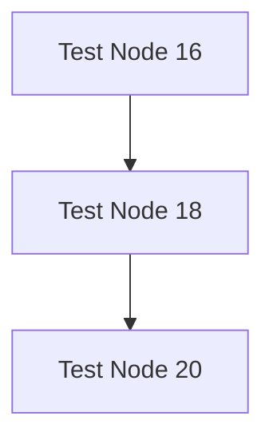
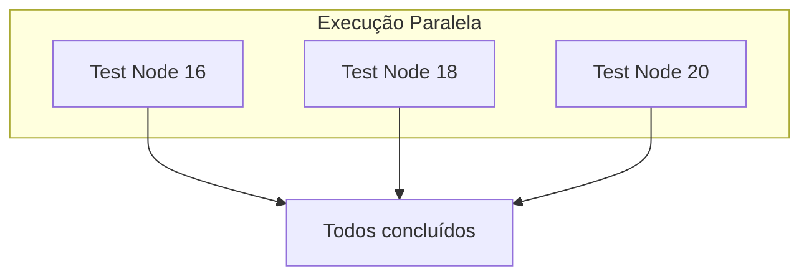
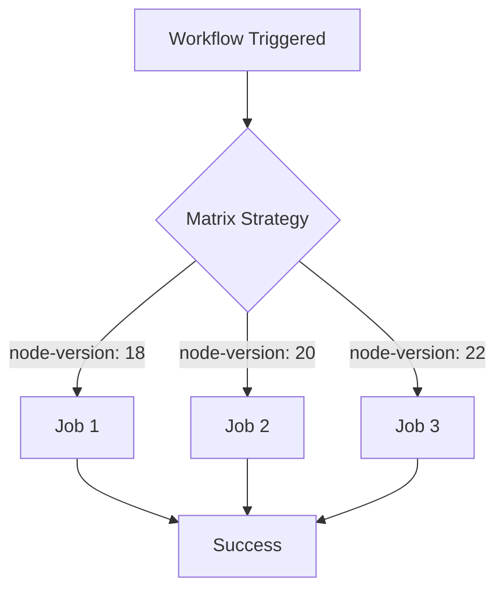
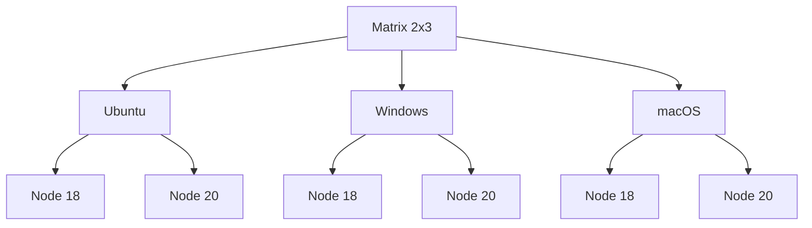
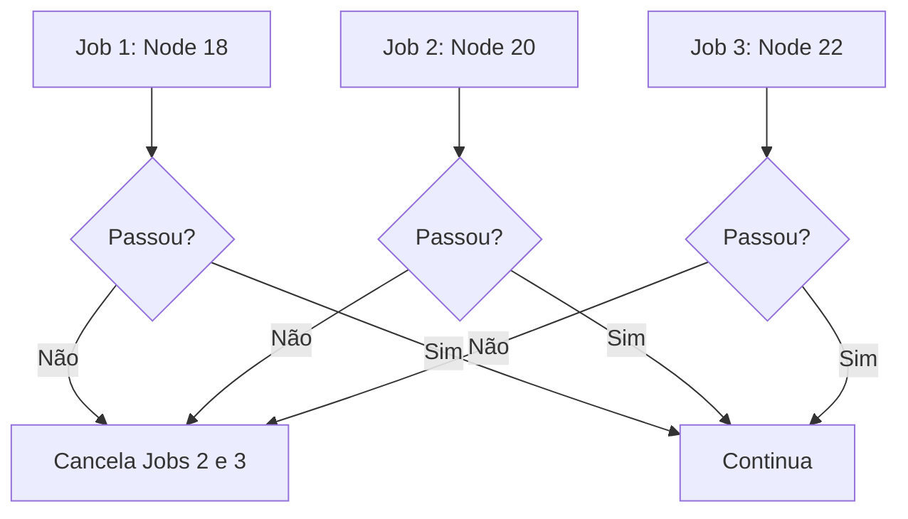

# 🎬 Vídeo 2.2 - Escalabilidade com Paralelismo (Matrix Strategy)

**Aula**: 2 - Otimização de Pipelines  
**Vídeo**: 2.2  
**Temas**: Otimizando o tempo de execução; Configuração da estratégia de matriz; Testes em paralelo; Múltiplas versões de linguagem

---

## 📚 Parte 1: Conceito de Matrix Strategy

### Passo 1: Problema da Execução Sequencial

**Sem Matrix Strategy:**



**Problema**: Execução sequencial = lento!

**Com Matrix Strategy:**



**Benefício**: Todos em paralelo = muito mais rápido!

---

## 🔧 Parte 2: Matrix Básica

### Passo 2: Criar Workflow com Matrix

**Linux/Mac:**
```bash
cd ~/fiap-dclt-aula02

# Criar workflow com matrix strategy
cat > .github/workflows/ci-matrix.yml << 'EOF'
# ============================================
# WORKFLOW: CI com Matrix Strategy
# Executa testes em múltiplas versões do Node.js
# ============================================
name: 🔄 CI with Matrix

on:
  push:
    branches: [ main ]
  workflow_dispatch:

jobs:
  test-matrix:
    name: 🧪 Test on Node ${{ matrix.node-version }}
    runs-on: ubuntu-latest
    
    # ============================================
    # STRATEGY: Define a matriz de execução
    # Cada combinação gera um job separado
    # ============================================
    strategy:
      matrix:
        node-version: [18, 20, 22]
    
    steps:
      - name: 📥 Checkout
        uses: actions/checkout@v4
      
      # Usa a versão da matriz
      - name: 🔧 Setup Node.js ${{ matrix.node-version }}
        uses: actions/setup-node@v4
        with:
          node-version: ${{ matrix.node-version }}
          cache: 'npm'
          cache-dependency-path: app/package-lock.json
      
      - name: 📦 Install dependencies
        working-directory: app
        run: npm ci
      
      - name: 🧪 Run tests
        working-directory: app
        run: npm test
EOF
```

**Windows (PowerShell):**
```powershell
cd ~\fiap-dclt-aula02

# Criar workflow com matrix strategy
@'
# ============================================
# WORKFLOW: CI com Matrix Strategy
# Executa testes em múltiplas versões do Node.js
# ============================================
name: 🔄 CI with Matrix

on:
  push:
    branches: [ main ]
  workflow_dispatch:

jobs:
  test-matrix:
    name: 🧪 Test on Node ${{ matrix.node-version }}
    runs-on: ubuntu-latest
    
    # ============================================
    # STRATEGY: Define a matriz de execução
    # Cada combinação gera um job separado
    # ============================================
    strategy:
      matrix:
        node-version: [18, 20, 22]
    
    steps:
      - name: 📥 Checkout
        uses: actions/checkout@v4
      
      - name: 🔧 Setup Node.js ${{ matrix.node-version }}
        uses: actions/setup-node@v4
        with:
          node-version: ${{ matrix.node-version }}
          cache: 'npm'
          cache-dependency-path: app/package-lock.json
      
      - name: 📦 Install dependencies
        working-directory: app
        run: npm ci
      
      - name: 🧪 Run tests
        working-directory: app
        run: npm test
'@ | Out-File -FilePath .github/workflows/ci-matrix.yml -Encoding UTF8
```

### Passo 3: Como a Matrix Funciona



**A matriz cria automaticamente 3 jobs paralelos!**

---

### Passo 4: Commit e Push do Workflow

**Linux/Mac:**
```bash
cd ~/fiap-dclt-aula02

# Ver workflow criado
ls -la .github/workflows/

# Adicionar workflow
git add .github/workflows/ci-matrix.yml

# Commit
git commit -m "feat(video-2.2): adicionar matrix strategy"

# Push
git push origin main
```

**Windows (PowerShell):**
```powershell
cd ~\fiap-dclt-aula02

# Ver workflow criado
Get-ChildItem .github/workflows/

# Adicionar workflow
git add .github/workflows/ci-matrix.yml

# Commit
git commit -m "feat(video-2.2): adicionar matrix strategy"

# Push
git push origin main
```

### Passo 5: Ver Execução no GitHub

**No GitHub Actions:**
1. Ir para **Actions**
2. Clicar no workflow **CI with Matrix**
3. Ver os 3 jobs executando em paralelo

**Resultado esperado:**
```
✅ Test on Node 18
✅ Test on Node 20
✅ Test on Node 22

Todos executam em paralelo!
```

---

## 🌐 Parte 3: Matrix 2D - Conceito (Node.js + OS)

### Passo 6: Entendendo Matrix 2D

**Podemos combinar múltiplas dimensões na matriz:**

```yaml
strategy:
  matrix:
    # Combinações: 2 versões × 3 OS = 6 jobs!
    node-version: [18, 20]
    os: [ubuntu-latest, windows-latest, macos-latest]
```

**Visualização:**



**Resultado**: 6 jobs executando em paralelo!

> **💡 Nota**: Este é um conceito avançado. Na prática, testar em múltiplos OS consome mais recursos do GitHub Actions.

---

## ⚙️ Parte 4: Configurações Avançadas da Matrix

### Passo 7: Include e Exclude

**Customizar combinações específicas:**

```yaml
strategy:
  matrix:
    node-version: [18, 20]
    os: [ubuntu-latest, windows-latest]
    
    # Adicionar combinação extra
    include:
      - node-version: 22
        os: ubuntu-latest
        experimental: true
    
    # Remover combinação específica
    exclude:
      - node-version: 18
        os: windows-latest
```

### Passo 8: Fail-Fast e Max-Parallel

```yaml
strategy:
  # Se um job falhar, cancela os outros (default: true)
  fail-fast: true
  
  # Limita jobs simultâneos (útil para recursos limitados)
  max-parallel: 2
  
  matrix:
    node-version: [18, 20, 22]
```

**Comportamento do fail-fast:**



---

**FIM DO VÍDEO 2.2** ✅
